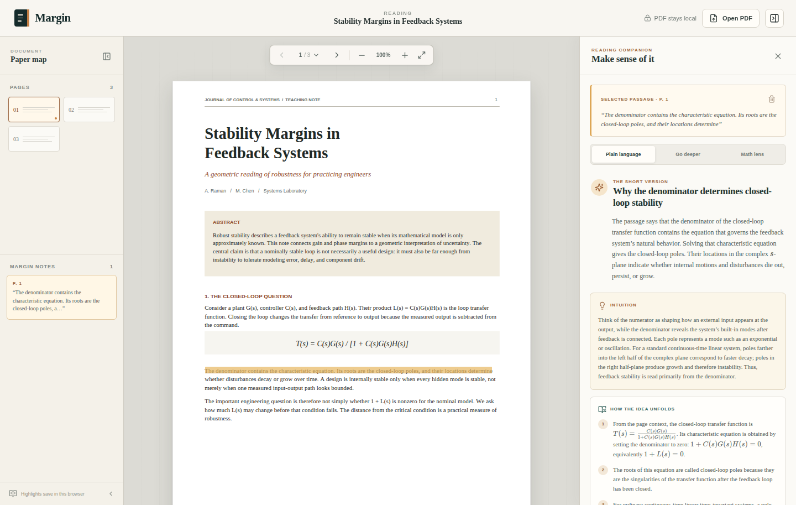

# Margin

Margin is a focused PDF reader for academic and engineering papers. Open a local
PDF, select a difficult passage, and get a structured explanation without
uploading the whole document. Explanation requests do send the selected
material and limited page context to the provider you configure; see
[Privacy](PRIVACY.md) for the complete data flow and browser-storage behavior.



## Quick start

You need Node.js 22 or newer and access to a supported language-model provider:
llama.cpp, OpenAI, Google Gemini, or a compatible Chat Completions API. Margin
opens PDFs locally in your browser; it does not upload the PDF file.

Clone the public repository:

```bash
git clone https://github.com/zhianguo/margin.git
cd margin
```

For the simplest local setup, start llama.cpp separately with the model alias
`margin-local` and its OpenAI-compatible API available at
`http://127.0.0.1:8080/v1`. Then, from the Margin project directory, run:

```bash
./start.sh
```

The launcher installs the Node.js dependencies when needed and starts Margin.
Open [http://localhost:5173](http://localhost:5173) in your browser.

If llama.cpp is running on another computer, provide its reachable API URL:

```bash
./start.sh --provider-url http://llama-host:8080/v1
```

If its model ID or `--alias` is not `margin-local`, add
`--model your-model-name`. See
[Run locally with llama.cpp](#run-locally-with-llamacpp) for the complete
llama.cpp command and remote-access guidance.
To use a hosted model instead, follow [Use OpenAI](#use-openai),
[Use Google Gemini](#use-google-gemini), or
[Use another OpenAI-compatible provider](#use-another-openai-compatible-provider).

Once Margin is open:

1. Choose **Try the demo paper**, or choose **Open PDF** to open a PDF from your
   computer.
2. Drag across a short passage, formula, or compact diagram.
3. Choose **Explain**, then use **Plain language**, **Go deeper**, or
   **Math lens** in the explanation panel.
4. Choose **Keep** when you want to save a selection without requesting an
   explanation. Saved highlights remain in this browser.
5. Click the **Margin** logo to return Home and **Resume reading** to return to
   the current document.

Explanation requests send the selected material and limited page context to
the provider you configured. See [How data moves](#how-data-moves) for the
details.

Current web sources can be added to an individual explanation when an operator
configures a search provider and the user explicitly opts in. See
[Web search](SEARCH.md) for setup, data flow, and limitations.

## What works

- Local PDF opening and an included three-page engineering demo paper
- Continuous, lazy-rendered PDF pages with selectable text and annotations
- Page navigation, zoom, and fit-width controls
- Text selections captured across PDF.js text spans and pages
- Highlights stored as page-relative rectangles so they stay aligned at any zoom
- Per-document highlights persisted in browser storage
- Plain-language, deep, and equation-focused explanation lenses
- Optional current web sources with per-selection opt-in, editable query,
  freshness, and citations
- Selectable OpenAI, Google Gemini, generic Chat Completions, or local llama.cpp
  explanation providers
- Schema-constrained output with runtime validation for every provider
- Rendered LaTeX, key terms, conceptual steps, connections, uncertainty, and a
  self-check question
- Optional, locally hosted formula-image recognition with a CPU pix2tex
  companion
- Image-first rendering for compact commutative diagrams and other connected
  two-dimensional math selections, with a geometry-aware text fallback
- Responsive reader and explanation panel
- Server-side rate limiting, request validation, CSP headers, and prompt-injection
  boundaries

## Run locally with llama.cpp

Requirements: Node.js 22 or newer and access to a current llama.cpp server
running an instruction/chat GGUF model. The llama.cpp server is managed
separately and can run on this machine or another HTTP-accessible system.

On the provider system, start `llama-server`. Replace the model path with your
own file:

```bash
./build/bin/llama-server \
  --model /absolute/path/to/instruct-model.gguf \
  --alias margin-local \
  --ctx-size 16384 \
  --host 127.0.0.1 \
  --port 8080 \
  --jinja
```

`--n-gpu-layers 99` can be added when your build and GPU support offloading.
To serve Margin from another system, bind `--host` to that machine's reachable
interface instead of `127.0.0.1` and restrict access with its firewall.
Wait for the server to become ready:

```bash
curl http://127.0.0.1:8080/health
curl http://127.0.0.1:8080/v1/models
```

Then start Margin with one command:

```bash
./start.sh --provider-url http://127.0.0.1:8080/v1
```

For a provider on another system, pass its reachable address:

```bash
./start.sh --provider-url http://llama-host:8080/v1
```

To use the optional formula OCR companion as well:

```bash
./start.sh --provider-url http://127.0.0.1:8080/v1 --start-formula-ocr
```

See [Formula OCR setup and operation](OCR.md) for Docker requirements, remote
hosting, configuration, security, and troubleshooting.

The launcher installs the Node dependencies when needed and defaults to the
`margin-local` model alias. Use `--model your-model-name` when the provider
reports a different model ID. If the provider requires authentication, set
`LLM_API_KEY` before the command. Plain HTTP exposes the selected passage in
transit, so use it only on a trusted network; use HTTPS for an untrusted network.

The equivalent manual setup is:

```bash
npm ci
cp .env.llamacpp.example .env
npm run dev
```

Open [http://localhost:5173](http://localhost:5173). The web app runs on port
5173, proxies `/api` to Margin on port 8787, and Margin calls the configured
llama.cpp URL. The explanation panel shows whether that provider is reachable.

The default llama.cpp environment is:

```dotenv
LLM_PROVIDER=llamacpp
LLM_BASE_URL=http://127.0.0.1:8080/v1
LLM_MODEL=margin-local
LLM_API_KEY=no-key
LLM_MAX_TOKENS=2048
LLM_TEMPERATURE=0.2
LLM_TIMEOUT_MS=300000
```

The model name must match the `--alias` passed to `llama-server`, or the model ID
shown by `/v1/models`. `LLM_API_KEY` can remain `no-key` while llama.cpp is
loopback-only with its default authentication settings.

Margin uses llama.cpp's `/v1/chat/completions` endpoint and its schema-constrained
`response_format`. The model prompt also describes every output field because
llama.cpp uses the schema to constrain generation but does not inject that schema
into the prompt. See the official
[llama.cpp server documentation](https://github.com/ggml-org/llama.cpp/blob/master/tools/server/README.md)
and [JSON Schema grammar documentation](https://github.com/ggml-org/llama.cpp/blob/master/grammars/README.md).

### Use OpenAI

```bash
cp .env.example .env
# Add your OPENAI_API_KEY to .env
npm run dev
```

Set `LLM_PROVIDER=openai`; `OPENAI_MODEL` defaults to `gpt-5.6-sol`. The PDF
reader and highlighting continue to work when the selected provider is offline
or unconfigured.

### Use Google Gemini

Create a Gemini API key, then copy the dedicated example:

```bash
cp .env.gemini.example .env
# Add your GEMINI_API_KEY to .env
npm run dev
```

The example configures:

```dotenv
LLM_PROVIDER=gemini
GEMINI_API_KEY=your_api_key_here
GEMINI_MODEL=gemini-3.6-flash
GEMINI_BASE_URL=https://generativelanguage.googleapis.com/v1beta/openai
GEMINI_MAX_TOKENS=2048
GEMINI_TEMPERATURE=0.2
GEMINI_TIMEOUT_MS=120000
```

Margin uses Google's OpenAI-compatible Chat Completions interface. The model
must support structured JSON output through `response_format`; see Google's
[Gemini OpenAI compatibility documentation](https://ai.google.dev/gemini-api/docs/openai).

### Use another OpenAI-compatible provider

Copy the generic example and enter the provider's API base URL, exact model ID,
and API key:

```bash
cp .env.openai-compatible.example .env
# Edit OPENAI_COMPATIBLE_BASE_URL, OPENAI_COMPATIBLE_MODEL, and the API key
npm run dev
```

The generic provider settings are:

```dotenv
LLM_PROVIDER=openai-compatible
OPENAI_COMPATIBLE_BASE_URL=https://provider.example/v1
OPENAI_COMPATIBLE_API_KEY=your_api_key_here
OPENAI_COMPATIBLE_MODEL=your-model-id
OPENAI_COMPATIBLE_MAX_TOKENS=2048
OPENAI_COMPATIBLE_TEMPERATURE=0.2
OPENAI_COMPATIBLE_TIMEOUT_MS=120000
```

This integration requires an OpenAI-compatible `/chat/completions` endpoint
that accepts structured output using `response_format` with a JSON schema and
returns the assistant text in `choices[0].message.content`. Compatibility
labels alone do not guarantee that those features are implemented. If the
endpoint requires no authentication, leave `OPENAI_COMPATIBLE_API_KEY` empty
or remove it; Margin will omit the `Authorization` header. Because compatible
providers do not share a reliable health endpoint, Margin reports their
reachability as unknown until an explanation request is made.

`start.sh` remains a llama.cpp-specific launcher. Start Margin with
`npm run dev` when using OpenAI, Gemini, or another compatible provider. Keep
real API keys only in the ignored local `.env` file: never commit them or place
them in client-side code. Margin reads provider keys on its server process and
does not include them in the browser bundle.

### Production build

```bash
npm run build
npm start
```

The Express server serves the built app and API at
[http://localhost:8787](http://localhost:8787).

### Customize the explanation panel

The explanation panel's typography and contrast are controlled by the
`--panel-*` custom properties near the top of `src/styles.css`. For example:

```css
:root {
  --panel-title-font-size: 22px;
  --panel-lead-font-size: 16px;
  --panel-body-font-size: 15px;
  --panel-text: #293936;
  --panel-text-muted: #465550;
}
```

Development mode applies these changes immediately. Run `npm run build` again
before restarting a production server.

### Select, keep, and clear a passage

Drag across PDF text, a formula, or a compact diagram. Choose **Explain** to
save the selection and open its explanation, or choose **Keep** to save it
without requesting an explanation.

- To clear a temporary selection that has not been kept, click an empty area of
  the PDF.
- To delete a saved selection, open it from **Margin notes** and click the
  trash-can button in the upper-right corner of the **Selected passage**,
  **Selected formula**, or **Selected diagram** card. This also removes the
  highlight from browser storage.
- To hide the explanation panel without deleting the saved selection, click the
  **×** in the panel's upper-right corner.

### Return Home and resume reading

Click the **Margin** logo in the upper-left corner to visit Home without closing
the current PDF. Margin keeps the reader mounted in the browser tab, including
its page, zoom level, highlights, and explanation-panel state. Choose
**Resume reading** to return.

Choose **Close current PDF** on Home only when you want to release that reading
session. Opening another PDF replaces the current session; saved highlights
remain associated with each PDF and reappear when that file is opened again.
The resumable session itself lasts for the current browser tab and is not yet a
multi-document or restart-persistent library.

## How data moves

```text
Local PDF in the browser
       │
       ▼
selected passage + optional derived notation + page text
       │
       ▼
POST /api/explain
       │
       ▼
selected LLM provider
├── OpenAI Responses API
├── Google Gemini Chat Completions
├── another compatible Chat Completions API
└── local llama.cpp Chat Completions
```

The browser does not send the PDF file to the application server. When the user
asks for an explanation, it sends only:

- the selected text;
- the recognized or manually corrected formula, when available;
- extracted text from that page, capped at 16,000 characters;
- the page number, document title, and selected explanation lens.

When the user also chooses **Include current web sources**, the configured
search provider receives the user-approved query and search controls, but not
the PDF or extracted page context. Margin initially builds that editable query
from the filename-derived document title and selected content. It sends the
returned titles, snippets, URLs, and source metadata to the selected LLM
alongside the explanation material. See [SEARCH.md](SEARCH.md) for the complete
optional-search flow and disclosure boundary.

Provider URLs and API keys never enter the browser bundle. PDF content is
treated as untrusted source material in the model prompt, so instructions
embedded in a paper are not followed.

See [PRIVACY.md](PRIVACY.md) for local-storage contents, deletion instructions,
provider considerations, and hosted-infrastructure boundaries.

## Architecture

```text
src/
├── App.tsx                    application state and explanation workflow
├── components/
│   ├── PdfReader.tsx          PDF.js rendering, lazy pages, zoom, selection
│   ├── LibraryRail.tsx        page map and saved highlights
│   ├── SelectionPopover.tsx   explain / keep selection actions
│   └── ExplanationPanel.tsx   structured explanation UI
├── lib/
│   ├── selection.ts           DOM Range → normalized page rectangles
│   ├── highlights.ts          local persistence
│   ├── documents.ts           local-file fingerprinting and Blob URLs
│   └── explain.ts             typed API client
└── types.ts

server/
├── index.ts                   local/Node API and static production server
├── llm.ts                     provider config, prompt, schema, adapters
└── sites-worker.ts            edge API and asset entrypoint for Sites
```

All providers share the same prompt, Zod validation, and explanation contract.
OpenAI uses the Responses API; Gemini, generic compatible providers, and
llama.cpp use OpenAI-compatible Chat Completions with structured JSON output.
For the hosted provider pattern, see the official OpenAI
[Structured Outputs guide](https://developers.openai.com/api/docs/guides/structured-outputs).

## Validation

```bash
npm run typecheck
npm test
npm run build
npm run smoke
npm run public:check
```

The demo smoke check actively changes to page 2 at 110% zoom and verifies that
Home → **Resume reading** preserves the same reader, page, and zoom.

The unit suite covers highlight geometry, persistence, provider configuration,
llama.cpp request serialization, structured output validation, health checks,
and API error handling. The browser smoke checks cover both the bundled demo and
a browser-local PDF under the production content security policy.
The browser smoke script uses the locally installed Google Chrome to verify PDF
canvas and text-layer rendering. Add `--exercise` to select demo text and exercise
the configured LLM route.

For an optional real-world PDF check, download the pinned public fixture:

```bash
npm run fixture:download

SMOKE_PDF_PATH=.cache/pdf-fixtures/arxiv-2003.05465v2.pdf \
  node scripts/browser-smoke.mjs \
  http://127.0.0.1:5173 \
  /tmp/margin-public-paper.png \
  --upload-local
```

This downloads Chapman and Flammia,
[*Characterization of solvable spin models via graph invariants*](https://arxiv.org/abs/2003.05465),
from arXiv at runtime, verifies its pinned SHA-256 digest, and stores it only in
the ignored `.cache/` directory. Its arXiv record identifies the paper as
CC BY 4.0. The project-generated `public/demo-paper.pdf` remains the only PDF
committed to the repository.

The production build also emits `dist/server/index.js`, a small edge entrypoint
used by OpenAI Sites. Its request contract and prompt match the local Express API,
while static assets remain the Vite build.

A local `.openai/hosting.json` is copied into the build when present, but it is
not required for normal builds and is intentionally ignored because it
identifies a specific deployment.

A Sites deployment cannot reach llama.cpp at `127.0.0.1` on your computer. Local
llama.cpp is intended for `npm run dev` or `npm start` on the same machine. A
hosted worker can use llama.cpp only when `LLM_BASE_URL` is a network-reachable,
secured HTTPS endpoint.

## Current boundaries

- Image-only/scanned PDFs need OCR before their text can be selected.
- Text extraction from complex two-column layouts may have imperfect reading
  order.
- Non-text figures and tables are not yet selectable as visual regions.
- Highlights are local to one browser; export and account sync are not included.
- The first release keeps one structured explanation per passage/lens and does
  not yet provide a follow-up chat thread.

Useful next additions would be region-based figure explanation, full-page OCR,
annotation export, paper-wide search, and citation-aware follow-up questions.

## Security

See [SECURITY.md](SECURITY.md) for private vulnerability reporting and
deployment guidance.

## License

Margin is available under the [MIT License](LICENSE). The bundled demo paper is
generated by this project and is covered by the same license. Third-party PDFs
downloaded for optional testing retain their respective licenses and are not
committed to this repository.
